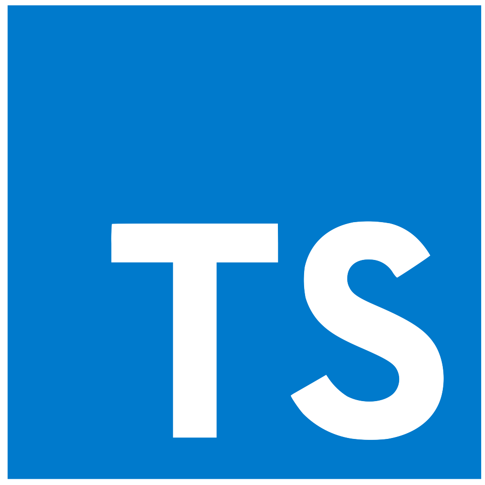
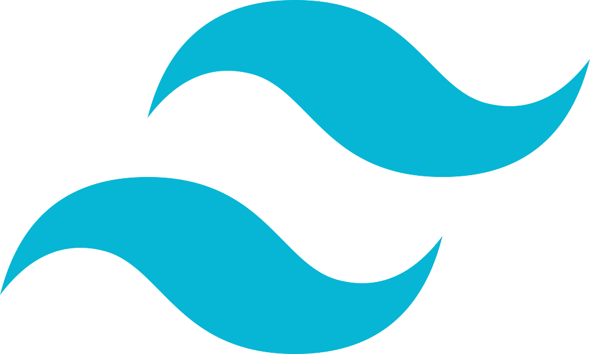
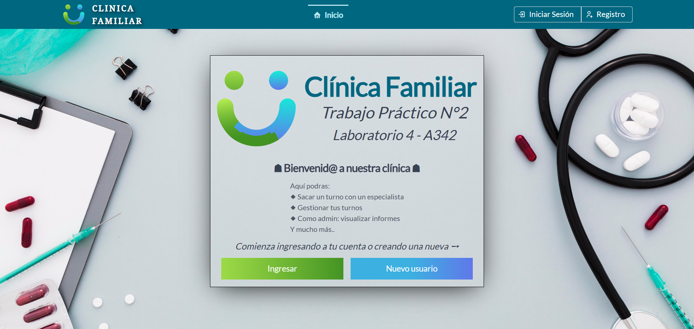
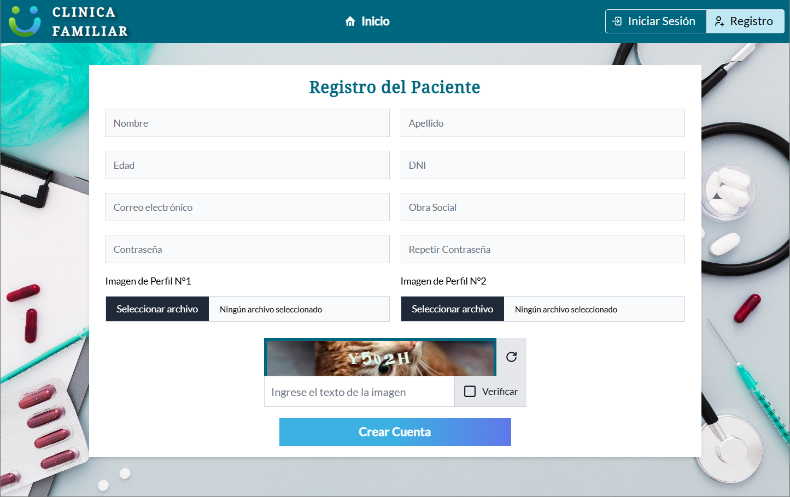
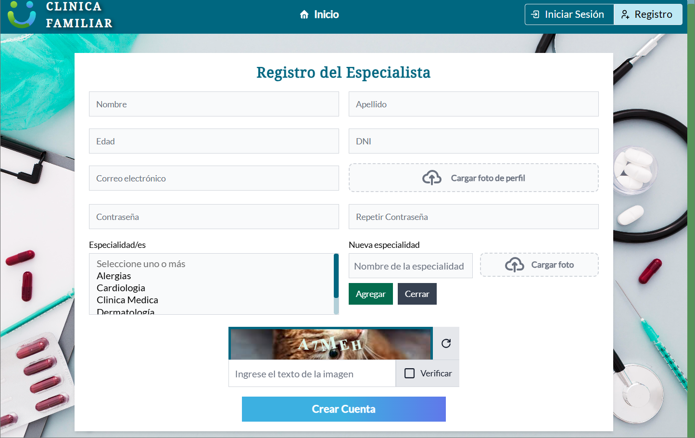
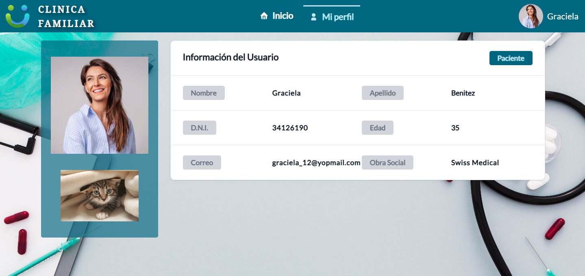

<h1 align="center">Clinica Familiar</h1>
<h3 align="center">
  
   
  <em>By Romina Calani Cruz</em>
   
</h3>

## Trabajo Practico N°2 - Laboratorio 4 UTN.FRA

Sistema de Gestion de turnos para una Clinica.

## 👥 Perfiles

- Administrador
- Especialista
- Paciente

## 🔒 Acceso rápido

## ➕ Registro 

- Paciente

Un nuevo Paciente registrado debe verificar su cuenta usando el link enviado a su correo personal.

- Especialista

Un nuevo Especialista registrado debe verificar su cuenta usando el link enviado a su correo personal y además un usuario con perfil Administrador debe habilitar su cuenta.
Podra agregar una especialidad y opcionalmente una foto asociada a esta.

## 👤 Sección Usuarios

Acceso permitido únicamente para usuarios con perfil de Administrador. Desde esta sección, es posible crear nuevos usuarios con perfil de Paciente, Especialista o Administrador. Los Administradores creados aquí no requieren validación de cuenta, mientras que los perfiles de Paciente y Especialista sí deben validarla.

## 🪪 Mi perfil

Visualiza los datos del usuario. 

- Los usuarios con perfil de Especialista tendrán la opción de agregar horarios específicos para cada especialidad, asegurando que no haya cruces entre los horarios de distintas especialidades. Además podra editar la duracion del turno por Especialidad, esta duración debe estar en el rango de 15 a 60 minutos.

