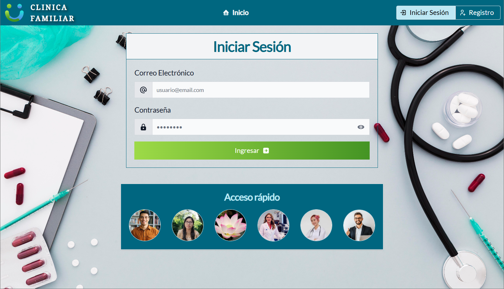

<h1 align="center">Clinica Familiar</h1>
<h3 align="center">
  
   
  <em>By Romina Calani Cruz</em>
   
</h3>

## Trabajo Practico N°2 - Laboratorio 4 UTN.FRA

Sistema de Gestion de turnos para una Clinica.

## 👥 Perfiles

- Administrador
- Especialista
- Paciente

## 🔒 Acceso

## Screenshots

